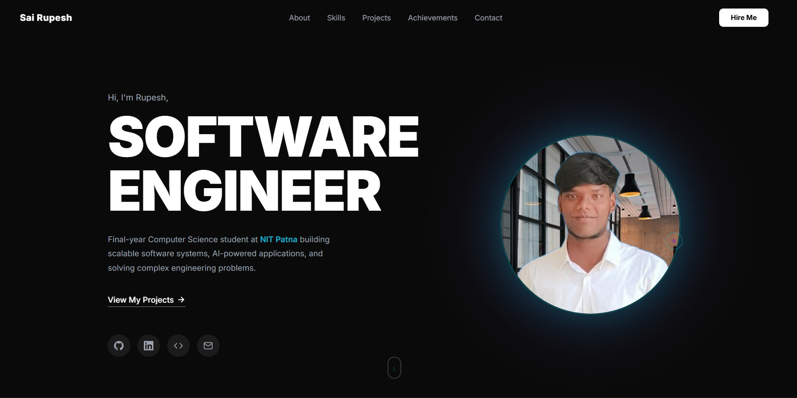

# 🚀 Devarinti Sai Rupesh — Portfolio Website

### ✨ Live Demo → [my-portfolio-orcin-omega.vercel.app](https://my-portfolio-orcin-omega.vercel.app)

---

## 👨‍💻 About Me

Hi! I'm **Devarinti Sai Rupesh**, a final-year Computer Science student at **NIT Patna** passionate about building scalable backend systems and AI-powered applications.

---

## 🌐 Live Portfolio

> 🔗 **[https://my-portfolio-orcin-omega.vercel.app](https://my-portfolio-orcin-omega.vercel.app)**

---

## 🛠️ Built With

| Technology | Purpose |
|-----------|---------|
| ⚛️ **React 18** | UI Framework |
| ⚡ **Vite** | Build Tool |
| 🎨 **Tailwind CSS** | Styling |
| 🚀 **Vercel** | Deployment |

---

## 🔗 Connect With Me

---

**Built with ♥ using React + Tailwind CSS**

⭐ If you like this portfolio, give it a star!

